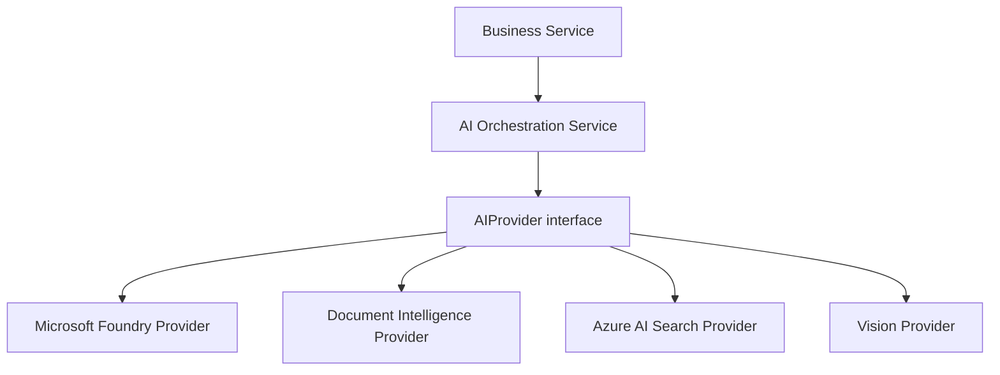

# AI Orchestration Service

FastAPI service for AI-assisted extraction, classification, relationship discovery, retrieval, and evaluation.

## Boundary

AI outputs are proposals only. The service does not create or update authoritative asset, inspection, risk, relationship, recommendation, or workflow records. Application/domain services must validate proposals, apply business rules, resolve conflicts, and persist authoritative records.

Every proposal carries:

- source references and optional excerpts
- confidence
- model provider, model name, and model version
- prompt identifier and prompt version
- generated timestamp
- `authoritative: false`
- `proposal_status: proposed`

## Run locally

From the repository root:

```powershell
$env:PYTHONPATH = (Get-Location).Path
uvicorn app.api.main:app --app-dir apps/services/ai-orchestration-service --reload
```

The local provider is deterministic and offline. Microsoft Foundry integration belongs behind `app/infrastructure/providers/microsoft_foundry/client.py` and must map responses into the shared proposal contract.

## Provider architecture



Business services call the orchestration/application boundary. Provider-specific SDK calls, credentials, response mapping, and retries belong only in the corresponding adapter under `app/infrastructure/providers/`. The orchestration layer returns the shared proposal models and never persists authoritative business records.

Select an adapter with `MODEL_PROVIDER`:

- `local-deterministic`
- `microsoft-foundry`
- `document-intelligence`
- `azure-ai-search`
- `vision`

## Endpoints

- `POST /api/v1/extraction/propose`
- `POST /api/v1/classification/propose`
- `POST /api/v1/relationship/propose`
- `POST /api/v1/rag/propose`
- `POST /api/v1/evaluation/propose`
- `GET /health`

## Column mapping

`POST /api/v1/column-mappings/propose` accepts a source file URI and canonical target fields:

```json
{
	"tenant_id": "tenant-1",
	"schema_name": "claim",
	"source_uri": "blob://incoming/claims.csv",
	"target_fields": ["policy_number", "incident_date", "loss_amount"]
}
```

The service profiles CSV, JSON, Excel, and Parquet samples, then returns a non-authoritative mapping proposal. If Azure OpenAI settings are present, the mapper uses structured output; otherwise it uses a deterministic normalized-name fallback and marks the proposal for review.

Review a proposal with `POST /api/v1/column-mappings/{mapping_id}/review`:

```json
{"reviewer": "analyst-1", "decision": "approved"}
```

Local development uses `MAPPING_STORE_PATH` for JSON persistence. Configure `BLOB_CONNECTION_STRING` for `blob://container/blob` sources, and configure `AZURE_OPENAI_ENDPOINT`, `AZURE_OPENAI_API_KEY`, and `AZURE_OPENAI_DEPLOYMENT` to enable Azure OpenAI structured output. Production should replace the local JSON store with a transactional database repository.
